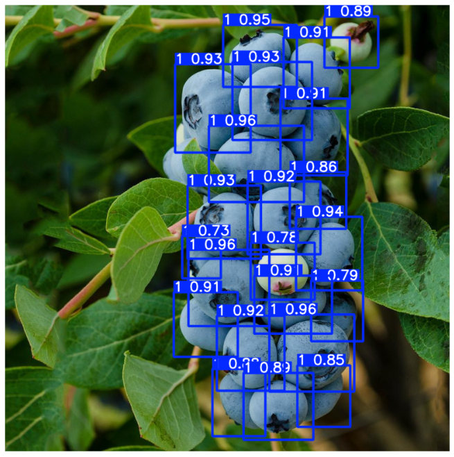
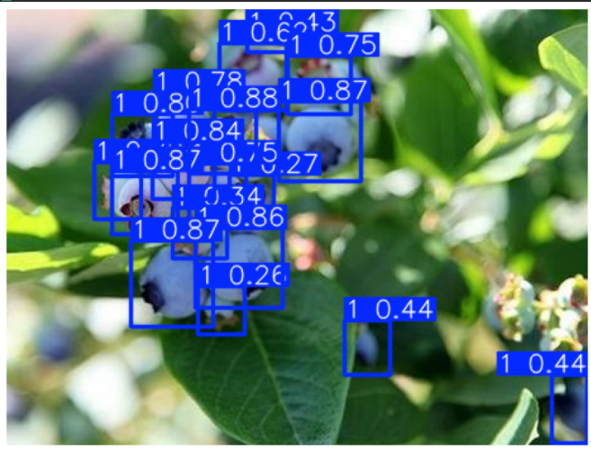

# Blueberry Detection & Counting (YOLOv8)

This project fine-tunes **YOLOv8** to detect **individual blueberries** (many small bounding boxes) and then converts detections into **per-image berry counts**.  
The goal is a practical baseline toward **yield estimation / precision agriculture** pipelines (e.g., drone or orchard imagery workflows).

## Sample Predictions

  
  

## Results (Validation)
Detection metrics (YOLOv8n fine-tuned):
- Precision: **0.905**
- Recall: **0.853**
- mAP@0.5: **0.918**
- mAP@0.5:0.95: **0.597**

Counting evaluation (GT vs Pred on validation images):
- MAE: **9.0** berries/image  
- RMSE: **10.75** berries/image

Validation summary:
- Images: **8**
- Berry instances: **571**

## What I Built
1) **Training pipeline** in Google Colab (dataset unzip + YAML path fixing + YOLO training).  
2) **Evaluation** (mAP metrics on validation split).  
3) **Inference** (saved prediction images with bounding boxes).  
4) **Counting output** (CSV with per-image predicted berry counts).  
5) **Counting evaluation** (CSV with GT vs Pred + MAE/RMSE).

## Repo Structure
blueberry-yolo/
- notebooks/Blueberry_YOLOv8.ipynb
- weights/best.pt
- results/metrics.json
- results/berry_pred_counts.csv
- results/berry_count_eval.csv
- assets/predictions/sample_01.jpg ... sample_06.jpg
- fixed_data.yaml
- requirements.txt
- README.md

## Run Inference (Local)
Install:
pip install ultralytics opencv-python pyyaml pandas matplotlib

Predict on an image:
yolo predict model=weights/best.pt source=path/to/image.jpg imgsz=640 conf=0.25
